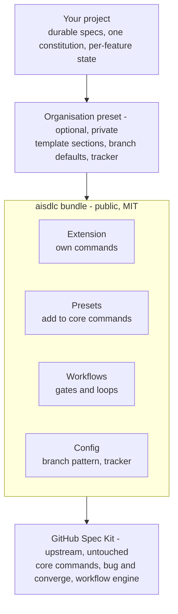

# Architecture

aisdlc is a set of standard Spec Kit packages. It installs on top of a normal `specify-cli`
installation, with no fork, no bundled copy of Spec Kit and no wrapper command-line tool.

## The pieces

| Piece | What it does |
|---|---|
| **Extension** (`aisdlc`) | Adds aisdlc's own commands, named `speckit.aisdlc.<command>` |
| **Presets** | Add text before or after Spec Kit's commands, and add new templates |
| **Workflows** | Chain steps together on Spec Kit's workflow engine, with approval gates and loops |
| **Bundle** | Installs all of the above at one version in a single step |

## Why upgrades stay safe

1. **Compose, never replace.** aisdlc never ships its own copy of a Spec Kit command or template.
   It only adds before or after them, so upstream improvements flow straight through.
2. **Public contract only.** aisdlc relies only on Spec Kit's documented manifests, hooks, workflow
   steps and CLI commands, never on its internal code.
3. **Compatibility is a release gate.** CI installs the supported Spec Kit versions and the latest
   release, and exercises the bundle, before any aisdlc release ships.

## Organisation presets

aisdlc itself is generic. An organisation adds its own conventions — extra template sections,
branch naming, an issue tracker such as Jira, framework-specific practices such as SAFe — as a
separate preset that installs on top. This keeps aisdlc reusable and lets organisations keep their
specifics private.
