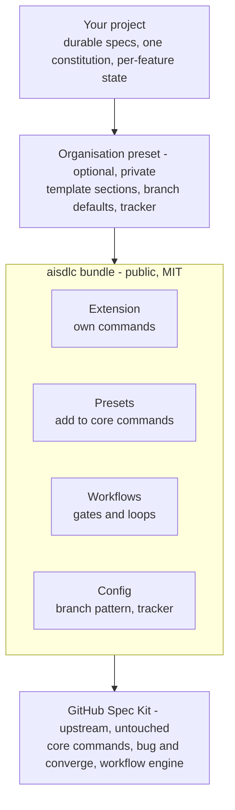

# Architecture

aisdlc is a set of standard Spec Kit packages. It installs on top of a normal `specify-cli`
installation, with no fork, no bundled copy of Spec Kit and no wrapper command-line tool.

## The pieces

| Piece | What it does |
|---|---|
| **Extension** (`aisdlc`) | Adds aisdlc's own commands, named `speckit.aisdlc.<command>` |
| **Presets** | Add text before or after Spec Kit's commands, and add new templates |
| **Workflows** | Chain steps together on Spec Kit's workflow engine, with approval gates and loops |
| **Bundle** | Installs all of the above at one version in a single step |

## Why upgrades stay safe

1. **Compose, never replace.** aisdlc never ships its own copy of a Spec Kit command or template.
   It only adds before or after them, so upstream improvements flow straight through.
2. **Public contract only.** aisdlc relies only on Spec Kit's documented manifests, hooks, workflow
   steps and CLI commands, never on its internal code.
3. **Compatibility is a release gate.** CI installs the supported Spec Kit versions and the latest
   release, and exercises the bundle, before any aisdlc release ships.

### What the contract research found

The Spec Kit 1.0 public contract is recorded, pinned at v1.0.13, in
[`docs/research/upstream-spec-kit.md`](https://github.com/vishalkhondre/speckit-aisdlc/blob/main/docs/research/upstream-spec-kit.md).
These findings feed the capability map. They are not decisions yet.

- **Presets are the safe way to change core commands.** A preset can add text before or after a core
  command and leave the upstream body intact.
- **Hooks are weak for anything mandatory.** The agent interprets them, and conditions and priority
  are not enforced. Anything that must happen is better placed in a workflow step or a preset.
- **Workflow overlays are project-level.** No package, including an organisation preset, can ship
  them. An organisation would need a setup step, its own wrapping workflow, or a preset instead.
- **Testing floor and latest.** The research recommends CI test the lowest supported Spec Kit version
  and the latest release, plus a scheduled run against latest, because upstream tightens validation
  in patch releases.
- **Candidate version range:** `>=1.0.5,<2.0.0`. Proposed, not decided; to be settled before phase 3.
- **Unattended runs:** the workflow engine has no per-run switch. Several options are listed in the
  research; none has been chosen.

## Organisation presets

aisdlc itself is generic. An organisation adds its own conventions — extra template sections,
branch naming, an issue tracker such as Jira, framework-specific practices such as SAFe — as a
separate preset that installs on top. This keeps aisdlc reusable and lets organisations keep their
specifics private.
