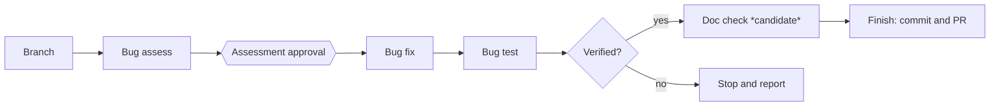
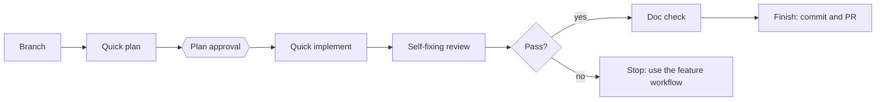
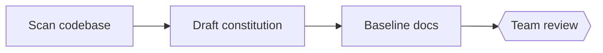

# Product overview

aisdlc provides workflows for the main kinds of change a team makes. Each workflow chains Spec
Kit's own commands with commands aisdlc adds, and pauses at human approval gates. Every step can
also be run by hand as an interactive command (`/speckit-aisdlc-<command>` in agents that use
skills), so the workflows are a convenience, not the only way in.

> **Status: proposed.** These workflows are the current design, not released features. Steps marked
> *candidate* are still being evaluated. Workflow names are placeholders.

| Workflow | Use it for | Ends with |
|---|---|---|
| Feature | A new capability, greenfield or in an existing codebase | Spec, plan and tasks kept in the repo; updated docs; PR |
| Bugfix | Something is broken | Assessment, fix and test reports; regression test; PR |
| Quick change | A trivial, well-defined tweak (a label, a message, a config value) | Small plan, review result, PR |
| Brownfield onboarding *(candidate)* | Preparing an existing codebase before its first feature | Draft constitution and baseline docs |

## Feature workflow

```mermaid
flowchart LR
    A[Branch] --> B[Specify] --> C[Clarify] --> G1{{Spec approval}}
    G1 --> D[Plan] --> G2{{Plan approval}} --> E[Tasks] --> F[Analyze]
    F --> H[Implement] --> I[Converge loop]
    I -->|work remains| H
    I --> J[Verify *candidate*] --> K[Review *candidate*]
    K --> L[Docs reconcile] --> M[Finish: commit and PR]
```

The converge loop compares the code with the spec, plan and tasks, adds tasks for anything missing,
and repeats implementation until nothing remains (with an iteration limit). Specs are never deleted.

## Bugfix workflow

Diagnosis, fix and verification stay separate. Only a verified fix can be shipped.

## Quick change workflow

No spec or task list. If the review can't fix every issue in one pass, the change is too big for
this workflow.

## Brownfield onboarding *(candidate)*

Run once per existing codebase. Content is marked as *observed* (inferred from code) or *guideline*
(stated by people), so later work knows what is intent and what is just current behaviour.

## Underneath every workflow

- **Per-feature session state**, so parallel feature branches don't interfere.
- **Decision log** with the reasoning and rejected alternatives for each significant choice.
- **Handoffs** between steps, so each step starts from a short brief instead of a long chat history.
- **Issue tracker link**: GitHub issues built in; other trackers through an organisation preset.
- **Configurable branch names**, defaulting to `feature/<key>-<slug>`.
