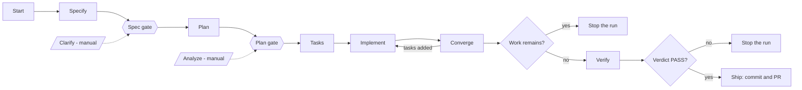
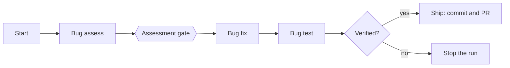
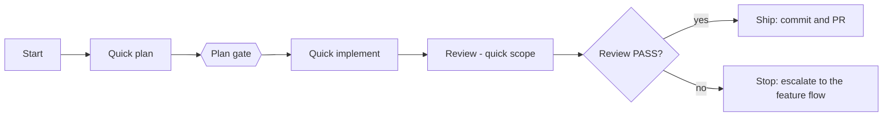
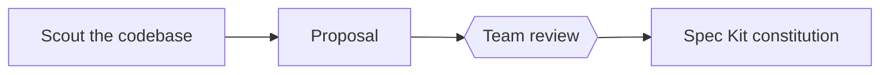

# Product overview

aisdlc provides flows for the main kinds of change a team makes. Each flow chains Spec Kit's own
commands with commands aisdlc adds, pauses at human approval gates, and ends at a pull request ready
to merge. Every aisdlc command can also be run by hand as an interactive command
(`/speckit-aisdlc-<command>` in agents that use skills).

> **Status: accepted design, not yet built.** This page follows the accepted
> [capability map](https://github.com/vishalkhondre/speckit-aisdlc/blob/main/docs/research/capability-map.md)
> (D-029). Nothing is released yet. Each flow is a Spec Kit workflow, run with
> `specify workflow run <name>`; the names are fixed by D-038.

| Flow | Workflow | Use it for | Arrives in |
|---|---|---|---|
| Feature | `aisdlc-feature` | A new capability, greenfield or in an existing codebase | Phase 4 (MVP) |
| Bugfix | `aisdlc-bugfix` | A defect in existing behaviour | Phase 5 (later) |
| Quick change | `aisdlc-quick` | A small change with no new requirement | Phase 5 (later) |
| Onboarding | `aisdlc-onboard` | Preparing an existing codebase before its first feature | Phase 5 (later) |

Until the quick change flow ships, small fixes use a plain branch and pull request. The feature flow
is for features.

## Feature flow — `aisdlc-feature` (phase 4, MVP)

- **Start** creates the branch from the configured pattern, links the tracker item, and records the
  chosen flow and why.
- **Clarify and analyze are manual commands, not workflow steps.** Run clarify at the spec gate if the
  spec has open questions, then resume. Analyze is read-only and is useful before the plan gate.
  Neither runs unattended, because neither writes a file a check can confirm.
- **The converge loop** reuses Spec Kit's `converge`. It compares the code with the spec, plan and
  tasks, appends tasks for anything missing, and runs implement again. It has an iteration limit
  (default 5). If work still remains when the loop ends, the run stops.
- **Verify** runs the configured checks (tests, lint, optional security scanners) and maps the results
  to the requirements. The run stops unless the verdict is PASS. A skipped check never counts as a pass.
- **Ship** refuses a non-PASS verdict. An explicit override is recorded as a decision. The PR body
  carries the spec path, the verdict, requirement coverage, a decision summary and a "documentation
  possibly affected" note (until docs reconciliation arrives in phase 5). Specs are kept.

## Bugfix flow — `aisdlc-bugfix` (phase 5, later)

Built around Spec Kit's own `bug` commands. Diagnosis, fix and verification stay separate, and only a
verified fix can be shipped. Spec Kit's own bugfix workflow stays usable on its own.

## Quick change flow — `aisdlc-quick` (phase 5, later)

For changes that fit the size rule below. The quick-scope review includes a constitution check
(D-034). The flow writes a minimal spec (the instruction and an acceptance line) so Spec Kit tools that
expect a spec still work.

## Onboarding flow — `aisdlc-onboard` (phase 5, later)

Run once per existing codebase. The proposal marks content as *observed* (inferred from the code) or
*guideline* (stated by people). After the team approves it, Spec Kit's own constitution command writes
the constitution.

## Definition of Ready and Done

Items in **bold** are enforced by mechanical checks. The rest is team practice that aisdlc records.

| Flow | Ready to start | Done (ready to merge) |
|---|---|---|
| Feature | A tracker item (or none, if the tracker is set to none); a problem statement; flow type confirmed at start | **Spec and plan approved at gates**; **all tasks closed and converge clean**; **verification PASS** (no skipped check counted as passing); PR links tracker item and spec; **human PR review approved** |
| Bugfix *(phase 5)* | A reproducible report or tracker item | **Assessment approved**; **regression test added and passing**; **bug test result verified**; PR; human PR review |
| Quick change *(phase 5)* | Fits the size rule; no new requirement | **Plan approved**; **review PASS** (constitution included); PR; human PR review |

Organisations can tighten Done through verify's configured checks and, later, a guard policy file,
without forking aisdlc.

## Choosing a flow

The size rule (configurable):

- A new requirement, a schema or public API change, or more than 5 files changed: use the feature flow.
- Anything smaller: use the quick change flow.
- A defect in existing behaviour: use the bugfix flow.
- An idea not yet worth building: use Spec Kit's `assess`.

There is no separate routing command. Start applies the rule, asks you to confirm, and records the
choice. In phase 4 only the feature flow exists.

**Escalation.** If a quick change or a bug turns out to be a feature: keep the branch, record a
decision saying why, pass the quick plan or bug assessment to specify as input, and let converge assess
any code already written.

## What is recorded per feature

Everything is committed under `specs/<feature>/` and kept (D-004).

| File | What it holds |
|---|---|
| `.aisdlc/state.json` | Flow type, spec path, tracker key, optional parent and tags, list of stories |
| `.aisdlc/events.jsonl` | One line per gate or check: outcome, time, and the git user who approved |
| `decisions.md` | Append-only decision log (`DEC-####`): flow choice, overrides, escalations |
| `brief.md` | The latest brief: a short note each step leaves for the next (D-027) |
| `verification.md` | The verify verdict and requirement coverage |

By default one spec is one backlog item, one branch and one pull request (D-033). Keep specs small, one
or two user stories, so pull requests stay small.

## Out of scope

aisdlc stops at a ready-to-merge pull request. It has no deploy command or workflow (D-028).
Deployment stays with your CI or an organisation preset.
